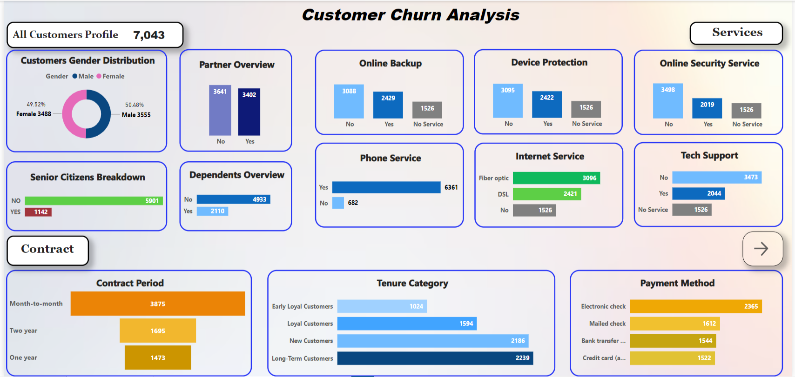
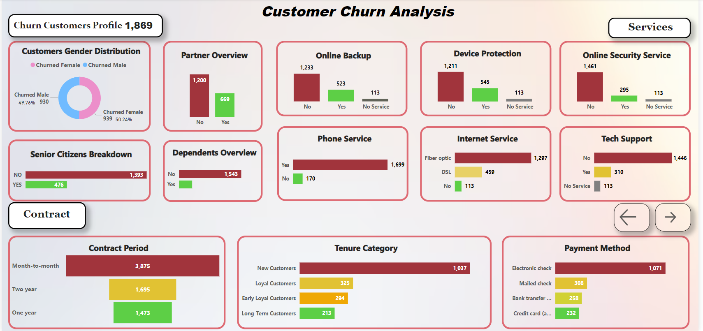
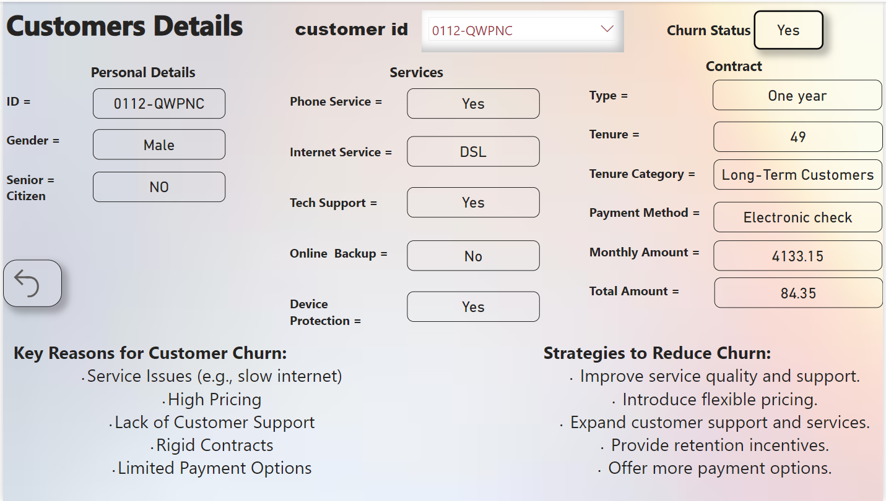

# Customer Churn Analysis and Retention Strategy Dashboard

## Project Overview
This project focuses on analyzing customer churn data and identifying key factors that contribute to customer churn. It includes an interactive Power BI dashboard that provides insights into customer behavior, retention strategies, and churn trends.

## Key Features
- Interactive Power BI dashboard
- Visualizations highlighting churn rates by various factors such as demographics, service usage, and customer lifetime
- Insights into improving customer retention strategies

## Tools Used
- **Power BI**: For building the dashboard and visualizing the data.
- **Dataset**: Customer churn dataset from [Kaggle].

## Visualization

*Description: A comprehensive overview of customer churn rates, showing the percentage of customers who have churned over a specified period.*

*Description: Analysis of customer churn segmented by demographics, providing insights into which customer groups are most at risk of churning.*

*Description: Visualization of proposed retention strategies based on churn analysis, highlighting targeted actions to reduce churn rates.*

## How to Use
- Download the `.pbix` file and open it in Power BI Desktop.
- Explore the interactive dashboard by selecting different filters and slicers to view various insights.

## Conclusion
This dashboard serves as a tool for businesses to better understand their customer churn rates and to identify effective retention strategies.
